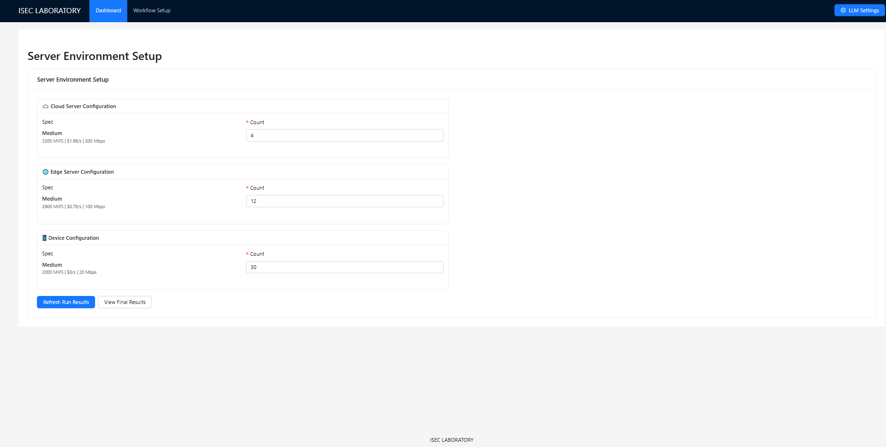
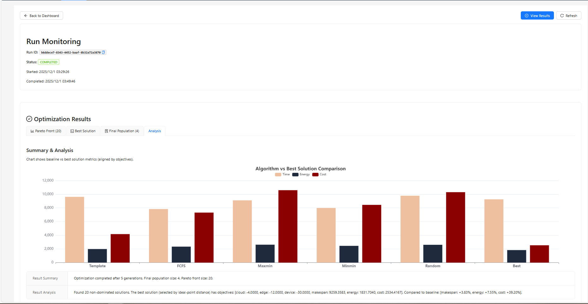
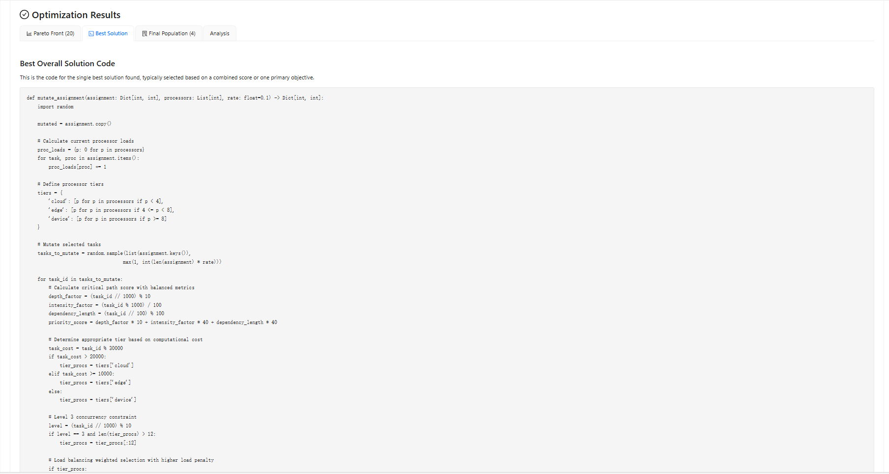
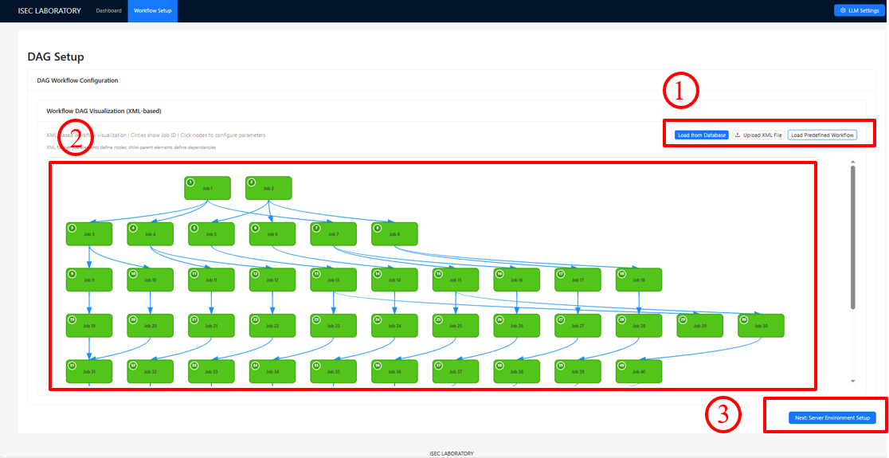

## LLMFlowGO
An LLM-Driven System for Integrated Workflow Generation and Optimization

## ✨ Developer
 * Developer organization:
 1. Shool of Internet, Anhui University, Hefei, China
 2. School of Computer Science and Technology, Anhui University, Hefei, China
 3. School of Information Technology, Deakin University, Geelong, Australia
 4. State Key Lab. for Novel Software Technology, Nanjing University, China

 * Developer Member: 
 * Jia Xu, Weibing Zhang, Xiao Liu,Jinglong Fang, Xuejun Li
## 🤖 Architecture

**Workflow Modeling**: The workflow modeling module uses large language models to automatically convert high-level task descriptions into expressive, adaptable workflow graphs that form the foundation for downstream optimization and execution.This workflow model can be exported from [LLM4Workflow](https://github.com/ISEC-AHU/LLM4Workflow)

**Service Recommendation**: LLMFlowGO distills raw DAGs into a compact semantic payload—built from extracted structures and computed graph features—to filter noise, define feasible service boundaries, and provide clear structural context for stable and efficient edge-environment planning.

**Algorithm Selection and Strategy Identification**: LLMFlowGO conducts a two-stage strategy analysis by first selecting suitable algorithms based on graph semantics, resource heterogeneity, and objectives, and then extracting their core decision logic into constraint-aware semantic interfaces to ensure generated strategies remain verifiable, usable, and system-aligned.

**Workflow Execution, Monitoring, and Optimization**: LLMFlowGO integrates GRS for efficient exploration and MEOH for strategy-driven evaluation, iteratively refining service-range configurations toward a dynamic ideal point and forming a closed feedback loop that enables continuous, quantifiable optimization.These comparison algorithms can be found in [EdgeWorkflow](https://github.com/ISEC-AHU/EdgeWorkflow).
## 🔍 How to use
Step 1: Select DAG modeling with advanced language generation in LLM4workflow, then you can modify node information as needed, and finally click the Next button.

